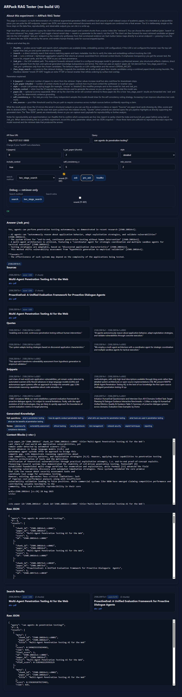

# ARPack — ArXiv Research Pack (Two‑Stage RAG Edition)



A compact, portfolio‑ready pipeline that fetches recent arXiv papers, **hydrates + chunks** full texts, summarizes with an LLM into a rich schema, builds **embeddings + FAISS**, and serves **search & advanced RAG Q\&A** via FastAPI — with a no‑build static UI at `/ui`.

> Designed to be extended into your broader research/RAG stack. Now with **optional two‑stage retrieval** (paper → chunk), **quote‑only synthesis**, **self‑consistency voting**, and **minimum‑sources enforcement** for stronger answers.

---

## 📦 Quick file expectations (indices)

**Two‑stage retrieval expects these exact files by default:**

* `data/index_papers.faiss`
* `data/index_papers.faiss.meta.json`  ← **note the `.json` extension** (single JSON object)
* `data/index.faiss`
* `data/index.faiss.meta.json`

You’ll also need the helper script at:

* `scripts/two_stage_retriever.py`

If the helper or any of the above files are missing, the API **falls back to single‑stage** retrieval under `/ask` and `/ask_pro`.

---

## ✨ What’s inside

* **Ingestion** → arXiv metadata + structured LLM summaries.
* **Hydration & Chunking** → PDF/HTML to clean text, per‑page chunks with stable IDs.
* **Embeddings** → OpenAI (default) or local `sentence-transformers`.
* **Indexing** → FAISS + sidecar meta JSON.
* **Two‑Stage Retrieval (optional)** → coarse paper recall + fine chunk ranking with mix weights.
* **RAG**:

  * **`/ask`** → simple, grounded Q\&A.
  * **`/ask_pro`** → GK expansions → diversified retrieval → **quote extraction** → **self‑consistency** → **min‑sources**.
* **UI** → static tester at `/ui` (no Node required).

---

## 🗂 Project layout (recommended)

```
api/
  main.py                 # FastAPI app (serves /ui if mounted)
data/
  papers.jsonl            # summarized paper records
  chunks.jsonl            # hydrated + chunked text
  index.faiss             # CHUNK index (recommended for RAG)
  index.faiss.meta.json   # sidecar metadata for chunk index
  index_papers.faiss      # PAPER index (for two-stage; optional)
  index_papers.faiss.meta.json  # sidecar metadata for paper index
scripts/
  build_index.py          # builds FAISS from JSONL
  hydrate_and_chunk.py    # expands papers -> full-text chunks
  pdf_worker_subproc.py   # robust PDF extraction helper (Windows-friendly)
  two_stage_retriever.py  # <— required for two-stage helper (moved here)
src/
  ingest.py               # fetch + summarize arXiv -> papers.jsonl
  embed.py                # embedding providers
  chunk.py                # cleaners + splitters
  schema.py               # Pydantic models for records
ui_static/
  index.html              # static UI mounted at /ui
```

> If your current files are at repo root, either move them into `scripts/` and `src/` as shown, **or** adjust imports/paths accordingly. The API’s auto‑loader specifically looks for `scripts/two_stage_retriever.py`.

Note: `scripts/build_index.py` now writes `embedding_dim` and `embed_model` into the `.meta.json` sidecar and will error at build-time if input embeddings have inconsistent dimensions. This helps catch mismatched embedding providers early.

---

## ⚙️ Requirements

* Python 3.10+
* Windows 11 / macOS / Linux
* `OPENAI_API_KEY` (if using OpenAI)
* Optional: `pandoc` for high‑quality HTML→text; `PyMuPDF`/`pdfminer.six` for PDFs

Install:

```bash
python -m venv .venv
source .venv/bin/activate   # (Windows: .\.venv\Scripts\Activate.ps1)
pip install -r requirements.txt
# Optional extras
pip install tiktoken beautifulsoup4 sentence-transformers pymupdf pdfminer.six
```

If FAISS pip install is problematic on Windows, use conda:

```bash
conda install -c pytorch faiss-cpu
```

---

## 🔐 Environment

Copy and edit:

```bash
cp .env.example .env
```

Key env vars:

| Env                        | Purpose / default                                                   |
| -------------------------- | ------------------------------------------------------------------- |
| `OPENAI_API_KEY`           | OpenAI auth (if used)                                               |
| `EMBEDDING_PROVIDER`       | `openai` \| `local` (default: `openai`)                             |
| `ARP_INDEX`                | chunk FAISS path (default: `data/index.faiss`)                      |
| `ARP_META`                 | chunk meta path (default: `data/index.faiss.meta.json`)             |
| `ARP_CHUNKS`               | chunks JSONL used to build `<ctx>` (default: `data/chunks.jsonl`)   |
| `ARP_PAPER_INDEX`          | paper FAISS path for two‑stage (default: `data/index_papers.faiss`) |
| `ARP_PAPER_META`           | paper meta path (default: `data/index_papers.faiss.meta.json`)      |
| `ARP_MIN_DISTINCT_SOURCES` | min citations in `/ask_pro` (default: `2`)                          |
| `ARP_SELF_CONSISTENCY_N`   | candidates for voting (default: `5`)                                |
| `ARP_MAX_CTX_CHARS`        | max chars of `<ctx>` passed to LLM (default: `12000`)               |
| `ARP_GK_ENABLED`           | enable GK expansions (default: `true`)                              |
| `ARP_PANDOC_PATH`          | optional path to pandoc                                             |

---

## 🚀 Quickstart

### 1) Ingest (summaries)

```bash
python -m src.ingest --cat cs.AI --limit 50 --out data/papers.jsonl
```

Notes:

* Uses arXiv ATOM feed (`feedparser` first, then `arxiv` client fallback).
* `--limit` is sent as `max_results`. Requests start at `start=0`.

### 2) Hydrate + chunk

```bash
python scripts/hydrate_and_chunk.py data/papers.jsonl data/chunks.jsonl --max-papers 5 --embed-now
```

* `--embed-now` stores vectors on each chunk row to speed indexing.
* Pandoc (if available) improves HTML → text quality.

### 3) Build FAISS

**Chunk index (recommended for RAG):**

```bash
python scripts/build_index.py data/chunks.jsonl data/index.faiss
# writes data/index.faiss and data/index.faiss.meta.json
```

**Paper index (for two‑stage):**

```bash
python scripts/build_index.py data/papers.jsonl data/index_papers.faiss
# writes data/index_papers.faiss and data/index_papers.faiss.meta.json
```

> Ensure both indices share the same embedding dimension.

### 4) Run the API

```bash
uvicorn api.main:app --reload --host 127.0.0.1 --port 8000
# UI: http://127.0.0.1:8000/ui
```

If `OPENAI_API_KEY` isn’t set, LLM endpoints fall back to “evidence only.”

---

## 🧪 Two‑Stage Retrieval (optional)

The API can call a helper that performs **paper‑stage** recall then **chunk‑stage** ranking with tunable weights.

**Files expected (defaults):**

* `data/index_papers.faiss`
* `data/index_papers.faiss.meta.json`  ← note `.json` (single JSON object; **rename from `.jsonl` if needed**)
* `data/index.faiss`
* `data/index.faiss.meta.json`

**Helper location:** `scripts/two_stage_retriever.py` (required for auto‑load)

**Smoke test (CLI):**

```bash
python scripts/two_stage_retriever.py \
  --paper-index data/index_papers.faiss \
  --paper-meta  data/index_papers.faiss.meta.json \
  --chunk-index data/index.faiss \
  --chunk-meta  data/index.faiss.meta.json \
  --q "bimanual robotic assembly lego" --k 8
```

**API endpoint:**

```
GET /two_stage_search?q=...&k=8&k_per_paper=2&top_m=75&paper_weight=0.4&chunk_weight=0.6
```

**Health check shows two‑stage status:**

```
GET /healthz
{ "two_stage": { "loaded": true, "top_m_papers": 75, "mix_weights": [0.4, 0.6] }, ... }
```

> If the helper is missing or import fails, `/two_stage_search` 500s; `/ask`/`/ask_pro` will silently fall back to single‑stage retrieval.

---

## 🔌 API Overview

### `GET /search?q=...&k=8&rerank=true`

Dense retrieval over FAISS (chunk or paper index depending on how you built it). Optional `rerank=true` applies a lightweight lexical reranker (TF‑IDF style) that boosts items with surface overlap with the query — useful when you want lexical precision instead of pure semantic similarity.

### `GET /ask`

Grounded answer (single pass). Returns `answer`, `citations`, `sources`, `snippets`, and optional `<ctx>`.
Optional query parameter `paper_ids` (comma-separated) is supported: when provided the server will constrain retrieval to the listed paper ids (useful to forward candidates from `two_stage_search`).

### `GET /ask_pro`

Advanced pipeline:

1. Generated Knowledge (query expansions)
2. Diversified retrieval (prefers two‑stage if available)
3. **Quote selection** (≤30 words/quote, with `paper_id`/`chunk_id`)
4. **Self‑consistency voting** (n candidates; pick best by distinct citations)
5. **Min‑sources enforcement** (default ≥2 when available)

Returns: `answer`, `citations`, `sources`, `snippets`, `quotes`, `gk`, `used_queries`, optional `context_blocks`.

Like `/ask`, `/ask_pro` also accepts `paper_ids` (comma-separated). The typical client flow is to run `two_stage_search` (optionally with `rerank=true`) to get a candidate set, then call `/ask_pro?paper_ids=...` so the LLM path synthesizes answers strictly from that filtered candidate set. The bundled UI at `/ui` now supports sending `two_stage_search` results into the pro pipeline.

---

## 🖥️ Built‑in UI (no Node)

1. Ensure `ui_static/index.html` exists (move your current `index.html` here).

2. In `api/main.py`:

   ```py
   from fastapi.staticfiles import StaticFiles
   app.mount("/ui", StaticFiles(directory="ui_static", html=True), name="ui")
   ```

3. Open: `http://127.0.0.1:8000/ui`

The UI lets you call `/healthz`, `/search`, `/ask`, `/ask_pro` and inspect **answers, citations, sources, snippets, quotes, GK, context, raw JSON**.

---

## 🩺 Troubleshooting

* **Two‑stage doesn’t load**

  * Ensure `scripts/two_stage_retriever.py` exists.
  * Verify file names exactly match defaults (note `.meta.json` extension).
  * Check FAISS dims on both indices.

* **`ModuleNotFoundError: No module named 'src'`**

  * Run modules from repo root:

    ```bash
    python -m src.ingest ...
    python scripts/hydrate_and_chunk.py ...
    python scripts/build_index.py ...
    ```

  * Or move files into `src/` and `scripts/` as shown above.

* **Wrong API key**

  * OS env can override `.env`. Print first 10 chars to confirm what the process sees.

* **Abstract‑only behavior**

  * If you index `papers.jsonl`, `/ask[_pro]` can only cite abstracts. For best results, index `chunks.jsonl`.

* **UI doesn’t load**

  * Ensure the folder name is exactly `ui_static/` and it contains `index.html`.

---

## ⚠️ Ethics & Safety

This project surfaces security research. **Do not** use it to attack systems you don’t own or have explicit permission to test. Follow applicable laws, licenses, and arXiv terms.

---

## 📝 License

MIT
